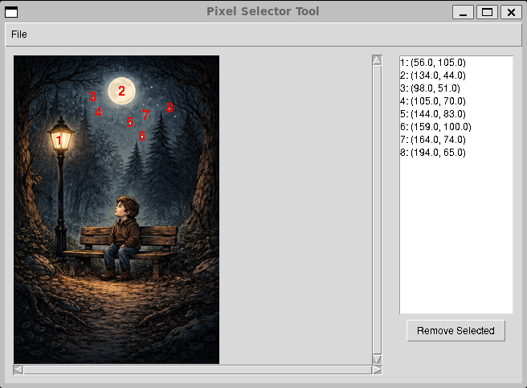

# Description

[](https://github.com/p3tri3/pixelselector/actions/workflows/ci.yml)
[](https://codecov.io/gh/p3tri3/pixelselector)
[](https://github.com/p3tri3/pixelselector/actions/workflows/codeql.yml)

PixelSelector is a small GUI tool for manually selecting pixel coordinates from
an image. Selected pixels are shown in an editable list, where you can reorder
or delete entries, and save the result as JSON plus an annotated reference
image.

The potential use case is to mark pixels in image. The pixels are saved
into JSON file. This information can be in another context to be used
to e.g. add animated features located at the selected pixels.

## Usage

Start the application with an optional image path:

```bash
python pixelselector.py [PNG_IMAGE]
```

If no image path is provided, start the app and load an image from the menu:
`File -> Load Image`.

Use the UI to:

- Click on the image to record pixel coordinates.
- Reorder pixels by dragging entries in the list.
- Remove selected pixels from the list.
- Save outputs with `File -> Save JSON`, `File -> Export Marked Image`, or `File -> Quick Save`.

Saved files are written to the current working directory using the input image
filename stem:

- `{image_filename}_pixels.json`
- `{image_filename}_reference.png`

## Example

Launch the app with the sample image:

```bash
python pixelselector.py example/image.png
```

For this input (`image.png`), the generated files are:

- `image_pixels.json`
- `image_reference.png`

This is the original image:


This screenshot shows the UI after some pixels have been manually annotated.
- The pixel order can be altered in the list.
- The numbering is based on the order in the list.
- The marked pixels can be deleted from the list.



The annotated image can be saved for later reference.
- The original image is not altered!


The selected pixel coordinates can be saved to a JSON file.

```json
{
  "pixels": [
    [
      56.0,
      105.0
    ],
    [
      134.0,
      44.0
    ],
    [
      98.0,
      51.0
    ],
    [
      105.0,
      70.0
    ],
    [
      144.0,
      83.0
    ],
    [
      159.0,
      100.0
    ],
    [
      164.0,
      74.0
    ],
    [
      194.0,
      65.0
    ]
  ]
}
```

## Development

Install the project with its dev dependencies and set up pre-commit hooks:

```bash
pip install -e ".[dev]"
pip install pre-commit
pre-commit install
```

Hooks run automatically on `git commit` and mirror the checks performed in CI
(ruff lint + format, mypy --strict, bandit).

Run the full test suite locally:

```bash
pytest
```
